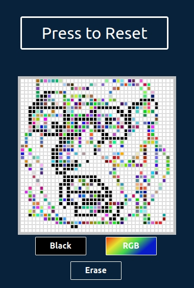

# Etch-A-Sketch

Browser version of something between a sketchpad and an Etch-A-Sketch.  
  
Built for the [Odin Project's](https://www.theodinproject.com/courses/foundations/lessons/etch-a-sketch-project) Foundation course

**[Try the Live Version Here!](https://wingedthing.github.io/Etch-A-Sketch/)**

